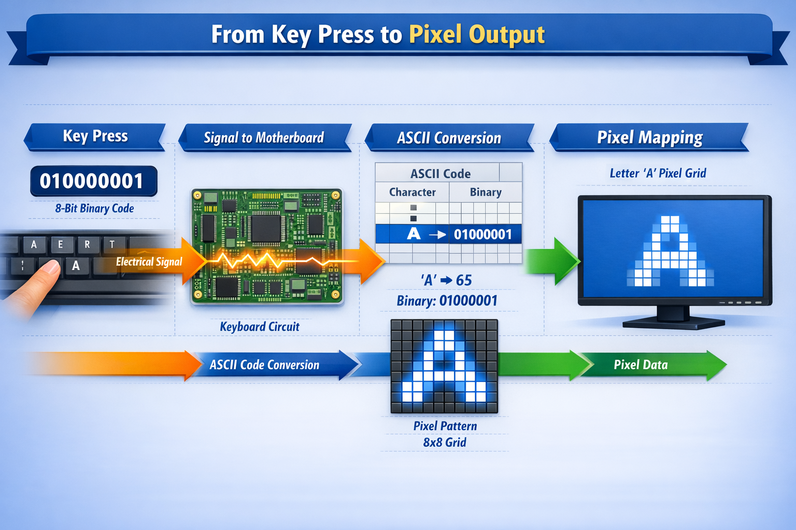
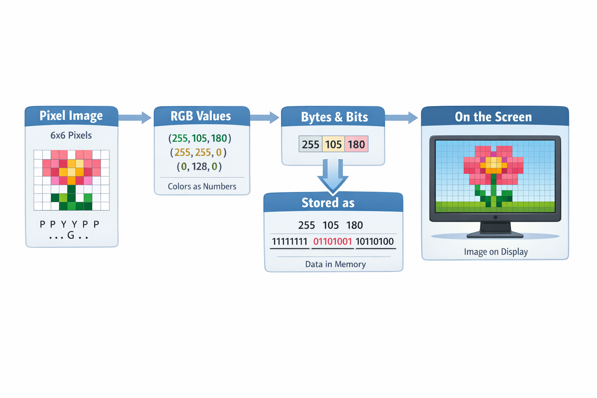
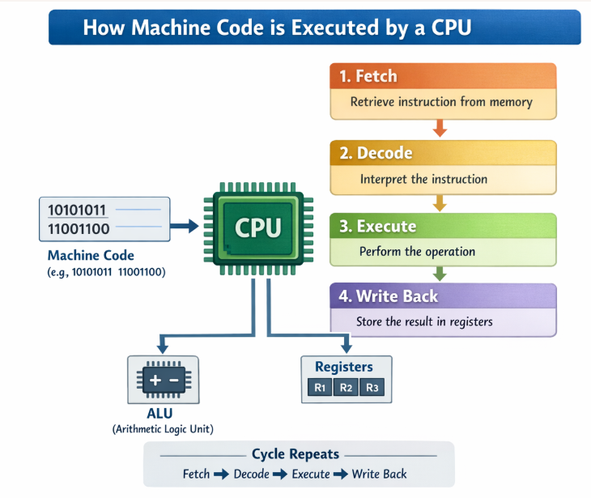

# Intro to computing

## Abstraction

* What is abstraction?
* Why is abstraction important?
* It is all a ilusion
* Without abstraction we can't understand, build, operate, and maintain complex systems
* Almost everything has layers and layers of abstractions

## How a computer stores information

### Example:
  * Teenagers dating code
    * Using lights at windows to indicate status
      * One light
      * Two lights
      * Three or more lights?
  * [Teenagers dating code example](excalidraw/_01_TeenagersCodes.png)
   
### Bit and Byte

* Bit
  * The bit is the most basic unit of information in computing and digital communication. 
  * https://en.wikipedia.org/wiki/Bit
* Byte
  * A byte is a unit of digital information that most commonly consists of eight bits.
  * https://en.wikipedia.org/wiki/Byte
* Byte Units
  * Kilo:  1024 Bytes
  * Mega:  1024 Kilo
  * Giga:  1024 Mega
  * Tera:  1024 Giga
  * Peta:  1024 Tera
  * Exa:   1024 Peta
  * Zetta: 1024 Exa
  * Yotta: 1024 Zetta
* Why 1K is 1024 and not 1000
  * Because it's 2¹⁰ and computers work in binary

## Numeric Systems

* Decimal
  * Base 10 number system
  * Uses 0-9
  * This is the system we use in everyday life
* Binary
  * Base 2 number system
  * Only uses 0 and 1
  * Example: 1011 in binary is 11 in decimal
  * How to convert to and from decimal to binary?
* Octal
  * Base 8 number system
  * Uses 0-7
  * Example: 123 in octal is 1010011 in binary
  * How to convert to and from decimal to octal?
* Hexadecimal
  * Base 16 number system
  * Uses 0-9 and A-F
  * Example: 1A3 in hexadecimal is 110100011 in binary
  * How to convert to and from decimal to hexadecimal?

## How Computers Store Different Types of Information

* Everything is stored as binary (0s and 1s).
* All these types of data are just numbers, stored as bits/bytes — the format / encoding tells software how to interpret the bits.
* Text
  * Each character is mapped to a number
  * ASCII
    * American Standard Code for Information Interchange, is a character encoding standard for representing a particular set of 95 (English language focused) printable and 33 control characters – a total of 128 code points.
    * https://en.wikipedia.org/wiki/ASCII
    * https://www.ascii-code.com/
    * The first convention globally used to map characters to numbers
    * Example:
      * Love
        * L = 76
        * o = 111
        * v = 118
        * e = 101
        * Binary: 01001100 01101111 01110110 01100101
        * Octal: 114 157 166 145
        * Decimal: 76 111 118 101
        * Hexadecimal: 4C 6F 76 65
  * Unicode
    * A universal *standard* that assigns a unique number (code point) to every character across all languages, symbols, and emoji
    * https://unicode.org/charts/
    * Covers over 140,000 characters — far beyond ASCII's 128
  * UTF-8
    * An *encoding* — defines how to store Unicode code points as bytes
    * Uses 1 to 4 bytes per character
    * Backward-compatible with ASCII (first 128 characters are identical)
    * The most widely used encoding on the web
    * Example: "love" in different languages:

      | Language | Text | Unicode Code Points |
      |----------|------|---------------------|
      | Chinese | 爱 | U+7231 |
      | Japanese | 愛 | U+611B |
      | Hindi | प्यार | U+092A U+094D U+092F U+093E U+0930 |
      | Korean | 사랑 | U+B098 U+C0BC |
      | Greek | αγάπη | U+03B1 U+03B3 U+03AC U+03C0 U+03B7 |
      | Hebrew | אהבה | U+05D0 U+05D4 U+05D1 U+05D4 |
      | Arabic | حب | U+062D U+0628 |
      | Portuguese | amor | U+0061 U+006D U+006F U+0072 |

  * Abstraction of pressing a key and seeing it in the screen
    * The physical key press is detected by the keyboard controller
    * The controller translates the key press into a scancode
    * The scancode is sent to the computer (USB, PS/2, Bluetooth)
    * The computer's operating system receives the scancode and translates it into a virtual key code
    * The virtual key code is sent to the active application
    * The application processes the virtual key code and performs the appropriate action
    * The application sends the character to the display driver
    * The display driver renders the character on the screen
      

* Images
  * Composed of pixels (picture elements)
  * Each pixel stores color values
  * RGB model: Red, Green, Blue — each channel is typically 0–255 (8 bits)
  * Example: A 1920×1080 image has over 2 million pixels, each storing RGB values
  * Abstraction of a image to screen
    

* Audio / Music
  * Sound is a continuous wave — it must be sampled (measured at regular intervals)
  * Sample rate: how many times per second the sound wave is measured (e.g., 44,100 Hz = CD quality)
  * The higher the sample rate and bit depth, the better the audio quality
* Video
  * A sequence of images (frames) played rapidly (e.g., 24, 30, or 60 frames per second)
  * Combined with audio synchronized to the frames
  * Uncompressed video requires enormous storage — compression is essential

## Application Types

* **Console**
  * Text-based interface, runs in a terminal/command prompt
  * No graphical UI; input/output via keyboard and text
  * Examples: CLI tools, scripts, batch processors


* **Desktop / Windows**
  * Installed and runs locally on a computer
  * Rich graphical user interface (GUI)
  * Examples: Microsoft Word, Photoshop, Visual Studio

* **Mobile**
  * Runs on smartphones and tablets (iOS, Android)
  * Designed for touch input and small screens
  * Examples: WhatsApp, Instagram, mobile banking apps

* **Web**
  * Runs in a browser, accessed via URL
  * No installation required; works cross-platform
  * Examples: Gmail, Google Docs, e-commerce sites

* **Web Services and APIs**
  * Backend services that expose functionality over HTTP
  * No user interface; communicates via data formats (JSON, XML)
  * Examples: REST APIs, SOAP services, payment gateways


## Type of programs: Source code vs Machine code

* Source code is human readable code
* Machine code is the actual instructions that the computer executes
  * Specific to the processor architecture (x86, ARM, etc.)
* A source code is transformed into machine code through a process called compilation / interpretation
  * Compilation
    * Source code is converted to machine code before execution
  * Interpretation
    * Source code is converted to machine code during execution
  * Java introduced the idea of mixing compilation and interpretation
    * First compiles to bytecode
    * Then interprets the bytecode
    * Other technologies like .NET also use this approach

### Source Code:
```csharp
Console.WriteLine("Hello World");
var price = 10.50;
var tax_percentage = 12;
var total = price + (price * tax_percentage / 100);
Console.WriteLine($"Total: {total}");
```

### IL (Intermediate Language) Bytecode:
```
IL_0000: ldstr "Hello World"                           // Load string "Hello World" onto the stack
IL_0005: call System.Console.WriteLine(string)         // Call WriteLine method with string parameter
IL_000a: ldc.i4 1050                                   // Load integer 1050 (10.50 * 100) onto the stack
IL_000f: newobj System.Decimal..ctor(int)              // Create new Decimal object from int on stack
IL_0014: stloc.0                                       // Store Decimal in local variable 0 (price)
IL_0015: ldc.i4 12                                     // Load integer 12 onto the stack
IL_001a: newobj System.Decimal..ctor(int)              // Create new Decimal object from int on stack
IL_001f: stloc.1                                       // Store Decimal in local variable 1 (tax_percentage)
IL_0020: ldloc.0                                       // Load local variable 0 (price) onto the stack
IL_0021: ldloc.0                                       // Load local variable 0 (price) onto the stack again
IL_0022: ldloc.1                                       // Load local variable 1 (tax_percentage) onto the stack
IL_0023: mul                                           // Multiply the top two values (price * tax_percentage)
IL_0024: ldc.i4 100                                    // Load integer 100 onto the stack
IL_0029: newobj System.Decimal..ctor(int)              // Create new Decimal object from int on stack
IL_002e: div                                           // Divide the top two values (result / 100)
IL_002f: add                                           // Add the top two values (price + tax_amount)
IL_0030: stloc.2                                       // Store result in local variable 2 (total)
IL_0031: ldstr "Total: {0}"                            // Load format string onto the stack
IL_0036: ldloc.2                                       // Load local variable 2 (total) onto the stack
IL_0037: box System.Decimal                            // Box the Decimal value as an object (for string formatting)
IL_003c: call System.Console.WriteLine(string, object) // Call WriteLine with format string and object parameter
IL_0041: ret                                           // Return from the method
```

### Actual Machine Code (x86-64) - JIT Compiled:
```
48 8D 0D 1A 20 lea rcx, [rip+0x201a]     ; Load string address
E8 C5 FF FF FF call <Console.WriteLine>  ; Call WriteLine function
48 8B 4C 24 20 mov rcx, [rsp+0x20]       ; Load decimal constant
48 89 4C 24 30 mov [rsp+0x30], rcx       ; Store price variable
48 8B 4C 24 28 mov rcx, [rsp+0x28]       ; Load decimal constant
48 89 4C 24 40 mov [rsp+0x40], rcx       ; Store tax_percentage
48 8B 4C 24 30 mov rcx, [rsp+0x30]       ; Load price
48 8B 54 24 40 mov rdx, [rsp+0x40]       ; Load tax_percentage
E8 B0 FF FF FF call <Decimal.Multiply>   ; Multiply decimals
48 8B 4C 24 50 mov rcx, [rsp+0x50]       ; Load result
48 8B 54 24 58 mov rdx, [rsp+0x58]       ; Load 100 decimal
E8 A0 FF FF FF call <Decimal.Divide>     ; Divide by 100
48 8B 4C 24 30 mov rcx, [rsp+0x30]       ; Load original price
48 8B 54 24 60 mov rdx, [rsp+0x60]       ; Load multiplication result
E8 90 FF FF FF call <Decimal.Add>        ; Add decimals
48 89 4C 24 70 mov [rsp+0x70], rcx       ; Store total
48 8D 0D 05 20 lea rcx, [rip+0x2005]     ; Load format string
48 8B 54 24 70 mov rdx, [rsp+0x70]       ; Load total
E8 80 FF FF FF call <Console.WriteLine>  ; Call WriteLine with formatting
C3             ret                       ; Return from function
```

### Key Machine Code Instructions Explained:

1. **48 8D 0D 1A 20 00 00** - `LEA` (Load Effective Address): Loads the address of the string "Hello World" into RCX register
2. **E8 C5 FF FF FF** - `CALL`: Calls the Console.WriteLine method
3. **48 8B 4C 24 30** - `MOV`: Moves data from stack memory to RCX register (loads price)
4. **48 89 4C 24 30** - `MOV`: Stores data from RCX register to stack memory (stores price)
5. **E8 B0 FF FF FF** - `CALL`: Calls the Decimal.Multiply method
6. **E8 A0 FF FF FF** - `CALL`: Calls the Decimal.Divide method  
7. **E8 90 FF FF FF** - `CALL`: Calls the Decimal.Add method
8. **C3** - `RET`: Returns from the function

### Pure Binary:

The hex bytes above are just a human-friendly representation. The CPU only ever reads **0s and 1s**:

```
01001000 10001101 00001101 00011010 00100000 00000000 00000000  ← lea rcx, [rip+0x201a]
11101000 11000101 11111111 11111111 11111111                    ← call <Console.WriteLine>
01001000 10001011 01001100 00100100 00100000                    ← mov rcx, [rsp+0x20]
01001000 10001001 01001100 00100100 00110000                    ← mov [rsp+0x30], rcx
11000011                                                        ← ret
```

> Every program, no matter how complex, is ultimately executed by the CPU as a sequence of 0s and 1s.
> Each group of 8 bits (e.g. `01001000`) is one **byte**. The CPU decodes these bit patterns into electrical signals.

### More on Machine Code

* [Machine Code](https://en.wikipedia.org/wiki/Machine_code)
* [How does Computer Hardware Work?](https://www.youtube.com/watch?v=d86ws7mQYIg)
* [The Fetch-Execute Cycle: What's Your Computer Actually Doing?](https://www.youtube.com/watch?v=Z5JC9Ve1sfI)
* [How computer execute instructions || with simple animation](https://www.youtube.com/watch?v=PgOKUZstCuc)


