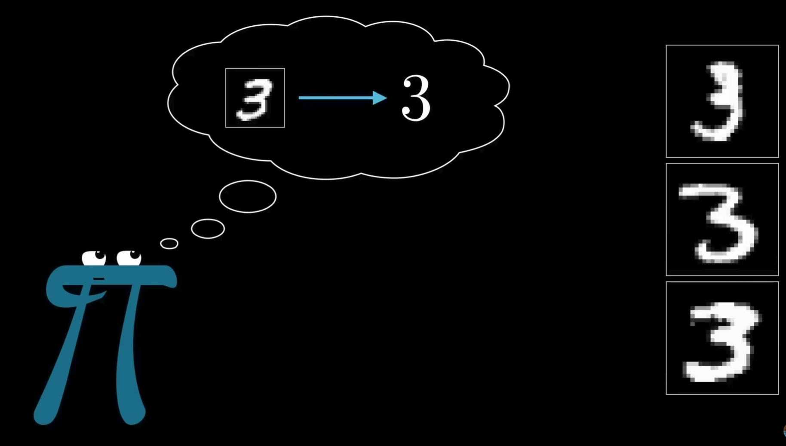
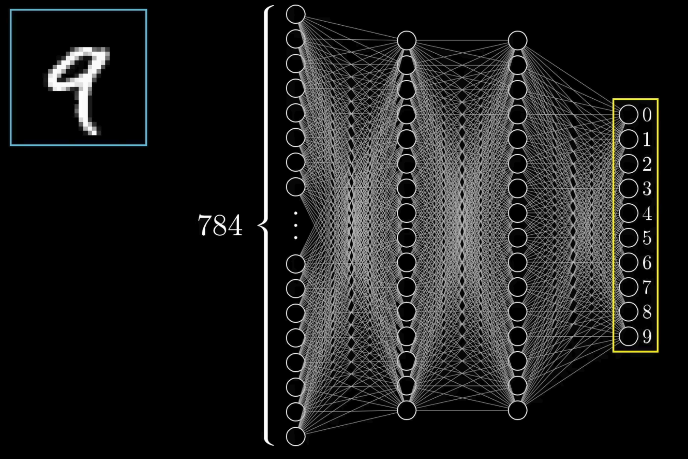
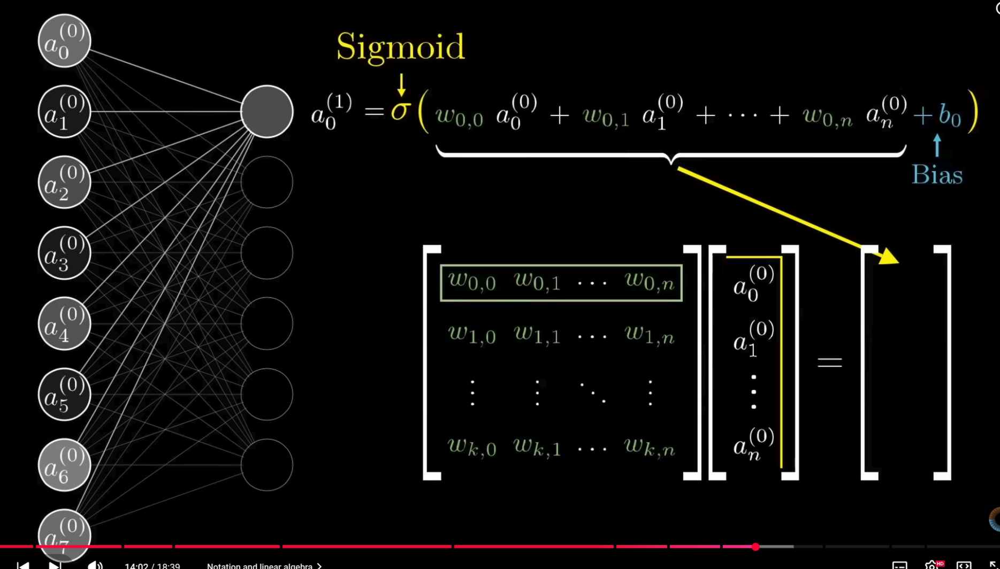
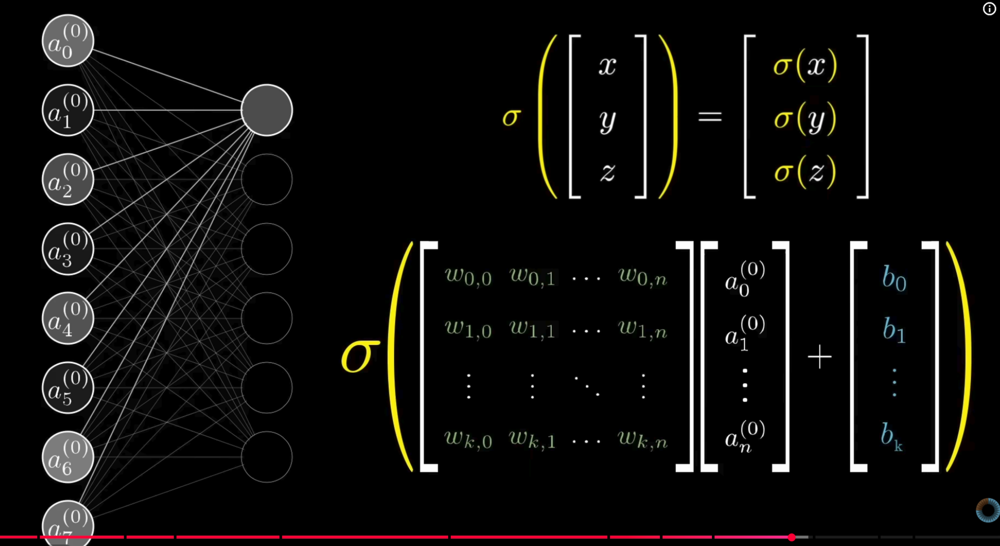
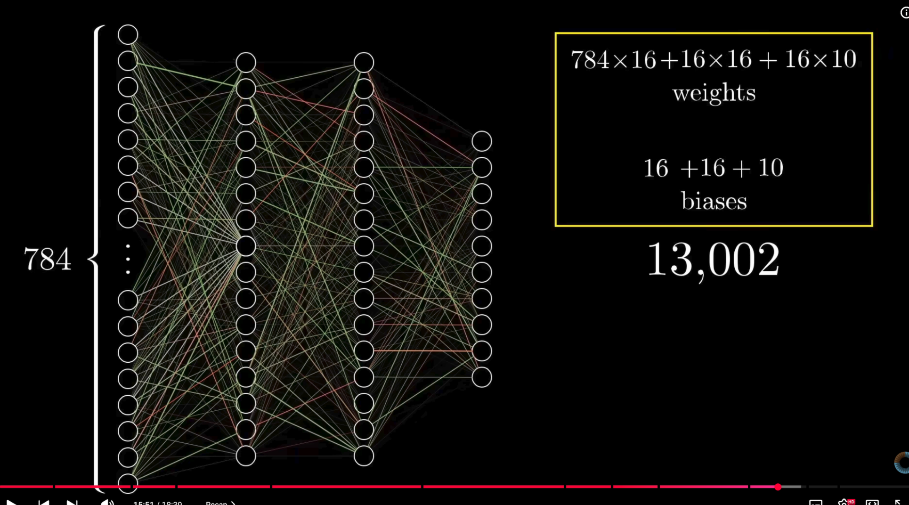

# Intro to AI for Software Engineering

## What is AI?

- AI (Artificial Intelligence) is the field of building systems that can perform tasks typically requiring human intelligence, such as understanding language, recognizing patterns, making decisions, and solving problems.
- In software engineering, AI helps automate routine work, surface insights, and speed up development across planning, coding, testing, and operations.

## Abstraction in AI

- Just as in software engineering (end everything else), the AI world is built on layers of abstraction.
- You do not need to understand every low-level detail to be productive and take advantage of it.
- You can write a SQL query and get results from a database without knowing
  - How B-trees
  - Query planners
  - Disk I/O schedulers
  - Replication consensus algorithms work.
- The database exposes a clean interface and a Language (SQL), and the complexity is hidden.
- You can build powerful applications by understanding the core concepts (embeddings, prompting, retrieval, tool use) and leveraging existing frameworks and APIs.
  - You do not need to hand-train transformer architectures from scratch, optimize CUDA kernels, or design novel attention mechanisms.

>**Note:** This is expected and normal. Mastery comes from knowing what each layer does, when to trust it, and how to compose the right tools for your problem — not from rebuilding everything from first principles every time.

## Why AI matters for software teams

- Accelerates development by generating code snippets, tests, and documentation
- Improves quality with automated defect detection and security checks
- Helps teams make decisions faster using data-driven insights
- Enables personalization and smarter applications through predictive models
- Like any other tool, framework, paradigm, etc., there is no guarantee of success and aboce all no magic :)

## Widespread Adoption Across the Industry

- AI tools have moved from experimental to mainstream: 95% of engineers use AI tools at least weekly, with 75% using them for half or more of their work (and 56% for 70%+)
  - (https://newsletter.pragmaticengineer.com/p/ai-tooling-2026)
- 84-92% of developers use or plan to use AI coding assistants daily or weekly.
  - https://firstlinesoftware.com/blog/ai-software-development-2026-2035/
- AI now generates a significant portion of new code: Google reports ~75% of new code is AI-generated (up from 25% in late 2024); overall industry estimates show 40-50%+ of code is AI-assisted.
  - https://dev.to/kanywst/what-11-big-tech-companies-actually-do-with-ai-in-2026-a-layered-numbers-first-breakdown-h58

## Core Use Cases in the Software Development Lifecycle

- Code Generation & Completion
  - Inline suggestions, boilerplate, full functions, and features (GitHub Copilot, Cursor, Claude Code, Amazon Q, etc.).
- Automated Testing
  - AI generates unit/integration tests, identifies edge cases, and creates test cases in parallel with development.
- Code Review, Refactoring & Quality 
  - AI-powered reviews, bug detection, refactoring suggestions, and security vulnerability scanning.
- Prototyping & Experimentation
  - AI accelerates early validation by generating proof-of-concept code, UI mocks, and integration experiments, but there is often a large gap and risk when moving these prototypes into production-grade systems.
- Documentation & Requirements
  - Auto-generating docs, summarizing code, translating requirements into specs.
- Debugging & Maintenance
  - Root cause analysis, legacy code modernization, and predictive issue detection.
- DevOps & Operations
  - CI/CD optimization, infrastructure provisioning, incident management, and deployment automation via AI agents.
- Source
  - https://www.mckinsey.com/capabilities/tech-and-ai/our-insights/the-ai-revolution-in-software-development

## Shift in Developer Roles: From Coder to Orchestrator

- Developers spend less time on routine coding and more on architecture, validation, system design, and overseeing AI agents.
- Rise of AI Agents: 55%+ of engineers use agents that can handle multi-step tasks (planning → coding → testing → PR submission).
- Human focus moves to higher-value work: intent definition, quality gates, and complex problem-solving.
- Several high-skilled engineers now report they rarely type production code manually; instead they prompt AI to generate implementations and then review those outputs very carefully before merging.
- Many experts now describe senior engineers as “reviewers of AI output” rather than pure code authors, with workflows that spend more time validating generated logic than writing syntax.
- References
  - https://techcrunch.com/2026/02/12/spotify-says-its-best-developers-havent-written-a-line-of-code-since-december-thanks-to-ai/
  - https://finance.yahoo.com/news/spotify-ceo-says-top-developers-103101995.html
  - https://medium.com/@yalovoy/the-senior-engineers-job-in-2026-is-code-review-not-code-writing-f804036c55ab
  - https://www.techinterview.org/post/3233475092/reviewing-ai-generated-code-skills/

## Productivity & Business Impact

- Reported gains
  - 30-55% faster task completion, 30%+ reduction in time-to-market, up to 64% increase in per-engineer output (e.g., Mercari).
  - Stripe (1,300+ PRs/week merged by agents)
  - Spotify (30% increase in code changes/developer)
  - Meta (50% of code changes from DevMate) show scaled impact.
- Challenges
  - Increased rework/bug rates in some cases
  - Need for strong human oversight
  - Potential code quality issues if not managed well.

### References

- "Becoming AI‑Native at Mercari: Group Strategy and a US Case Study" (Medium) and "What 11 big tech companies actually do with AI in 2026" (Dev.to)
  - https://medium.com/mercari-engineering/becoming-ai-native-at-mercari-group-strategy-and-a-us-case-study-fda4a3ee5877
  - https://dev.to/kanywst/what-11-big-tech-companies-actually-do-with-ai-in-2026-a-layered-numbers-first-breakdown-h58
- Stripe: "How Stripe's Minions Ship 1300 PRs a Week" (ByteByteGo)
  - https://blog.bytebytego.com/p/how-stripes-minions-ship-1300-prs
- Spotify: TechCrunch coverage and Medium analysis of AI coding agents
  - https://techcrunch.com/2026/02/12/spotify-says-its-best-developers-havent-written-a-line-of-code-since-december-thanks-to-ai/
  - https://medium.com/codetodeploy/how-spotify-built-an-ai-coding-agent-that-merged-1-500-prs-6e913b9b4ca5
- Meta / DevMate: LinearB analysis and Medium architecture breakdown
  - https://linearb.io/blog/meta-ai-control-plane-james-everingham-guildai
  - https://medium.com/@wasowski.jarek/meta-devmate-agent-marketplace-architecture-multi-model-ai-coding-platform-c796815d3431

## Popular Tools & Ecosystem (2026)

- The AI developer ecosystem in 2026 is led by a mix of large platform providers and specialist code assistants.
- Most-used tools combine IDE pair programming, conversational LLM copilots, knowledge retrieval, and codebase-aware agents.
- The top products are now embedded into developer workflows, and the largest vendors maintain the strongest enterprise adoption.
- Most-used AI tools in 2026 are those tightly integrated into IDEs and enterprise platforms.
- GitHub Copilot remains the leader for daily coding tasks, while OpenAI and Anthropic dominate chat-driven developer assistance.
- Google Gemini and Amazon Q are strongest in organizations that already use Google Cloud or AWS extensively.
- Specialized tools like Cursor, Sourcegraph Cody, Tabnine, and Replit Ghostwriter are important for codebase search, knowledge retrieval, and niche workflow automation.
- The largest five platforms account for roughly 70-75% of the overall developer AI tool market, with the rest split among niche assistants and enterprise-specific deployments.

| Tool | Owner | Primary Use | Approx. 2026 Market Share |
|---|---|---|---|
| GitHub Copilot | Microsoft / GitHub | IDE pair programming, code completion, doc-to-code | ~28% |
| ChatGPT (GPT-4.5/5) | OpenAI | general dev assistance, code generation, testing help | ~18% |
| Claude | Anthropic | enterprise code reasoning, safety-focused chat assistance | ~12% |
| Gemini | Google DeepMind | code search, multimodal dev workflows, RAG | ~10% |
| Amazon Q / CodeWhisperer | Amazon Web Services | cloud-native coding, DevOps, knowledge retrieval | ~9% |
| Cursor | Cursor | code generation, workflow automation, knowledge-to-code | ~6% |
| Sourcegraph Cody | Sourcegraph | code intelligence, repository search, RAG | ~5% |
| Tabnine | Perplexity | multi-language completion, local model support | ~4% |
| Replit Ghostwriter | Replit | browser-based coding, learning, and prototyping | ~3% |
| Windsurf | Windsurf AI | autonomous agent orchestration, developer productivity | ~3% |

>Note: Enterprise adoption in 90%+ of Fortune 100 companies continues, especially for tools that add compliance, security, and source-aware code reasoning.

## Strategic Recommendations for Companies

- Embed AI across the full lifecycle (not just coding).
- Implement guardrails, review processes, and training for effective human-AI collaboration.
- Measure success beyond speed: focus on quality, maintainability, and usiness outcomes.
- Prepare for AI-native development models and evolving team structures.
- AI agents becoming standard and developers "conductors."

### Warning: In some cases using AI can be a disaster

- Major production incidents have shown that AI-assisted code must never be treated as self-certified. After a series of outages, Amazon reportedly blocked deployment of AI-generated changes without human review and required senior approval for AI-assisted commits from junior and mid-level engineers.
- High-regulation industries such as finance, accounting, healthcare, and aerospace are particularly vulnerable. In these domains, AI-generated code can create compliance gaps, unsafe behavior, or legal liability if it reaches production without strong human oversight.
- Legacy and complex distributed systems are also high risk, because AI tools often lack full visibility into system-wide dependencies, data contracts, and operational constraints.
- Other common failure modes include insecure code patterns, leaked proprietary data in prompts or responses, and brittle logic that passes unit tests but fails in real-world production conditions.
- Best practice: 
  - Use AI as an assistant, not an autonomous deployer.
  - Maintain clear review gates, provenance tracking, deterministic checks, and a strong human-in-the-loop approval process before releasing AI-assisted code.

### References

- Amazon review gate example: https://x.com/godofprompt/status/2031419734537711825
- Industry post-mortem commentary: https://timonweb.com/ai/amazons-ai-code-broke-production-dont-let-yours-be-next/

## Key Terms

- LLM — Large Language Model
  - A Large Language Model is a type of AI trained on massive amounts of text to understand and generate human-like language.
- Model
  - A model is the trained mathematical function (a set of parameters and operations) that maps input tokens to output probabilities or predictions
  - In practice this is implemented as a neural network that was learned from data.
- Parameters / Weights
  - Parameters (also called weights) are the learned numeric values inside a model that determine its behavior.
  - Parameters encode relationships between words
    - During training, the model adjusts them so that semantically related words are positioned close together in the embedding space
    - So that word sequences that appear together in the training data have higher predicted probabilities.
  - More parameters usually increase capacity but also require more compute and memory.
- Token / Tokenizer / Token ID
  -  A token is a unit of text used by the model (word piece, subword, or character).
  - A tokenizer converts raw text into token IDs (integers) from a fixed vocabulary that the model processes.
- Inference vs Training
  - Training is the process of updating parameters from large datasets.
  - Inference (or serving) is using a trained model to generate outputs for new inputs without changing parameters.
- Context Window / Sequence Length
  - The context window (or sequence length) is the maximum number of tokens the model can process at once.
  - It determines how much conversation or document history the model can consider.
- Prompt
  - A prompt is the text (instructions, examples, or questions) given to the model at inference time to elicit a desired response.
  - Prompts can include few-shot examples to steer outputs.
- Fine-tuning / Instruction Tuning
  - Fine-tuning updates a pretrained model on task-specific data to improve performance.
  - Instruction tuning adapts a model to better follow human-style instructions.
- Few-shot / Zero-shot
  - Few-shot means providing a small number of examples in the prompt
  - Zero-shot means giving no examples and relying on the model's generalization from pretraining.
- Latency / Throughput
  - Latency is the time it takes the model to produce a response for a single request.
  - Throughput is how many requests (or tokens) a system can handle per unit time—important for scaling.
- RAG — Retrieval-Augmented Generation
  - RAG combines a language model with an external knowledge source (like docs, codebases, or manuals).
  - The model retrieves relevant facts and then generates answers using that context.
- MCP — Model Context Protocol
  - MCP is a framework for how AI agents can interact with external tools and structured data

## Understanding how LLM works

Large Language Models are built in two major stages: pretraining a statistical model on a huge corpus of text, then using that model to generate or score new text. A model is not a conventional program with explicit rules; it is a set of learned numerical weights that define how language patterns are represented and combined.

### Meaning is statistical, not semantic

- A LLM does not truly understand the meaning of a word in the way humans do.
- It learns statistical relationships between tokens from the training data and uses those relationships to predict what comes next.
- That means the model can generate fluent text about a concept like a `color`, `God`, or `love`, but it does so by estimating which words and phrases are likely to appear together, not by holding a real understanding of the thing itself.
- The model knows patterns of usage, not inner meaning.
- It can talk about “blue” or “red,” but it does not internally perceive or experience color.
- It can write about “love” or “God,” but it does so by reflecting how those words are used in text, not by understanding their deeper meaning.

### Weights and parameters

- A **parameter** is any learned numeric value inside the model.
- A **weight** is a type of parameter, usually the numbers inside the model's matrices and vectors that control how information is transformed.
- The model has many parameters because it contains many learned matrices and arrays:
  - **biases** — constants added to layer outputs that allow the model to shift activations independently of the input.
  - **embedding vectors** — learned representations for tokens that convert discrete vocabulary IDs into continuous numeric vectors.
  - **layer normalization offsets and scales** — learned values that normalize and rescale layer activations to stabilize training and improve generalization.
  - **attention key/query/value projection values** — learned matrices used to compute attention scores and transform tokens into keys, queries, and values for the attention mechanism.
- Parameters are not a count of word-to-word connections.
  - They are the learned coefficients that the model uses to compute relationships, attention, and predictions.
- A better way to think about it:
  - The model takes token embeddings as input.
  - It passes them through layers that use parameters to compute attention, transformations, and next-token probabilities.
  - Those parameters are what the model learns during training so that the output is likely to match the correct text.

#### What does "1 billion parameters" mean?

- When you see a model described as "100M," "1B," "7B," or "175B," that number is the **total count of learned numeric values** inside the model.
- It is not the number of words it knows, the number of rules it follows, or the size of its training data.
- A **100M parameter model** has roughly 100 million individual numbers (weights and biases) that were adjusted during training.
- A **1B parameter model** has roughly 1 billion such numbers.
- A **175B parameter model** (like the original GPT-3) has 175 billion learned values.
- Each parameter is a single floating-point number stored in the model's matrices.
- More parameters generally mean the model has more capacity to learn complex patterns, but it also requires more memory, more compute to run, and more data to train effectively.
- The parameter count is essentially a measure of the model's **size and capacity**, similar to how the number of neurons in a brain is a measure of its complexity — though it does not directly tell you how smart or capable the model is.

#### Common Models and Their Sizes

> **Note:** Memory size is approximate and depends on the precision (float16, float32, quantized). The numbers below assume **float16 (2 bytes per parameter)** for the raw weights. Quantized versions (4-bit, 8-bit) can run with far less memory.

| Model | Parameters | Approx. Memory (float16) | Notes |
|---|---|---|---|
| GPT-2 (small) | 124M | ~250 MB | One of the first widely used open LLMs |
| GPT-2 (XL) | 1.5B | ~3 GB | Much more capable than the small version |
| GPT-3 | 175B | ~350 GB | Proprietary; launched the modern LLM era |
| GPT-4 | ~1.7T (estimated) | ~3.4 TB (estimated) | Proprietary; exact size not public |
| LLaMA 2 7B | 7B | ~14 GB | Open weights; popular for local use |
| LLaMA 2 13B | 13B | ~26 GB | Strong balance of size and quality |
| LLaMA 2 70B | 70B | ~140 GB | High-quality open weights; needs multiple GPUs |
| LLaMA 3 8B | 8B | ~16 GB | Very capable for its size; runs on consumer GPUs |
| LLaMA 3 70B | 70B | ~140 GB | Competitive with many proprietary models |
| Mistral 7B | 7B | ~14 GB | Surprisingly strong for its parameter count |
| Mixtral 8x7B | 47B (active: 13B) | ~94 GB | Sparse Mixture of Experts; only 13B active per token |
| Gemma 2 9B | 9B | ~18 GB | Google's open lightweight model |
| Gemma 2 27B | 27B | ~54 GB | Strong performance on reasoning tasks |
| Claude 3 Haiku | ~? | N/A (API only) | Fast, efficient; exact size not public |
| Claude 3 Opus | ~? | N/A (API only) | High-end proprietary; exact size not public |

#### Representation

```text
1 [text] --> 2 [tokenizer] --> 3 [token IDs]
                    |
                    v
               4 [embedding lookup]
                    |
                    v
            5 [token embedding vectors]
                    |
                    v
           6 [transformer layers / attention]
                    |
             uses learned parameters
            /       |         \
           v        v          v
     7 [W_Q,W_K,W_V] [W_1,W_2] [biases]
                    |
                    v
          8 [context-aware vectors]
                    |
                    v
         9 [output logits / probabilities]
                    |
                    v
             10 [generated tokens]
```

- 1 [text] — the raw human-readable input sentence or document.
- 2 [tokenizer] — converts raw text into discrete tokens based on a vocabulary.
- 3 [token IDs] — integer indexes for each token that the model can process.
- 4 [embedding lookup] — maps each token ID to a learned dense vector.
- 5 [token embedding vectors] — continuous numeric representations of the tokens.
- 6 [transformer layers / attention] — transformer blocks that compute relationships between tokens and transform embeddings.
- 7 [W_Q,W_K,W_V], [W_1,W_2], [biases] — learned parameters used inside attention and feed-forward layers.
- 8 [context-aware vectors] — token representations enriched by attention to other tokens in the input.
- 9 [output logits / probabilities] — scores for every token in the vocabulary, representing how likely each next token is.
- 10 [generated tokens] — the final text chosen by sampling or picking the highest-probability tokens.

#### A concrete example from a short paragraph with more words
- Original text:
  ```text
  Polar bears hunt seals on the ice.
  Seals eat small fishes under the ice.
  Small fishes swim in schools to avoid predators.
  ```
- Tokenized text for each sentence:
  ```text
  ["Polar", " bears", " hunt", " seals", " on", " the", " ice", "."]
  ["Seals", " eat", " small", " fishes", " under", " the", " ice", "."]
  ["Small", " fishes", " swim", " in", " schools", " to", " avoid", " predators", "."]
  ```
- Each token is converted into a vector embedding.
- The model then computes attention relationships between those vectors both inside each sentence and across the paragraph.
- This example has stronger word relations:
  - `Polar bears` is a subject phrase.
  - `hunt` connects that subject to the object `seals`.
  - `seals` becomes the subject of the next sentence, where it `eat`s `small fishes`.
  - `small fishes` is shared between sentence two and three, and it is connected to `swim` and `schools` in the third sentence.
  - Context words like `ice`, `cold water`, and `predators` help the model understand the environment and meaning of the actions.
- A simplified relation graph for the paragraph looks like this:
  ```text
  [Polar bears] --hunt--> [seals] --eat--> [small fishes] --swim--> [schools]
        |                            |                   |
        v                            v                   v
        [ice]                     [cold water]       [predators]
  ```
- A more token-level view of the same idea:
  ```text
  [Polar] --> [bears] --> [hunt] --> [seals] --> [on] --> [the] --> [ice] --> [.] 
                                      |
                                      v
                                    [eat] --> [small] --> [fishes] --> [near] --> [the] --> [cold] --> [water] --> [.] 
                                                          |
                                                          v
                                                        [swim] --> [in] --> [schools] --> [to] --> [avoid] --> [predators] --> [.] 
  ```
- The model learns that `Polar` and `bears` belong together in the phrase `Polar bears`.
- It also learns that `seals` is both the object of `hunt` and the subject of `eat`.
- `small fishes` is reused, so the model keeps a contextual chain from sentence two into sentence three.
- The graph is only an illustration. In practice, the model uses parameters to compute attention scores and context-aware vectors, not a stored symbolic graph.
- Some parameters help compute how much one token should consider another token, but the total parameter count is the number of learned values in the model.
- Parameters define the strength and behavior of the model's computations across all tokens and layers.
- Tokens
  - Text is first broken into smaller pieces called tokens.
    - A token can be a whole word, part of a word, punctuation, or even a single character, depending on the tokenizer.
  - The model does not see raw characters or words directly;
    - Each token is mapped to an integer ID from a fixed vocabulary.
  - Example: `The sky is blue`
  - Might become:
    ```text
    ["The", " sky", " is", " blue"]
    [1024, 17, 4056, 213]
    ```
    - The ID sequence is the encoded input the model actually processes.
  - Simple training example:
    - Suppose we want a model to answer questions about colors using a tiny dataset.
    - Training data:
      - Input: "Question: What color is the sky? Answer:"
      - Target output: " blue"
  - Step-by-step:
  1. Tokenize the input and target.
     - Input tokens: ["Question:", " What", " color", " is", " the", " sky", "?", " Answer:"]
     - Target tokens: [" blue"]
  2. Convert tokens to token IDs.
     - Example IDs: [3001, 27, 431, 9, 12, 215, 5, 210, 77]
  3. Look up token embeddings for each ID.
     - IDs become vectors: [e3001, e27, e431, ...]
  4. Process embeddings through transformer layers.
     - Each layer uses learned parameters (weights and biases) to compute attention and transform the vectors.
     - Attention lets the model compare the word "sky" with the prompt context so it knows what the question asks.
  5. The model predicts the next token probability distribution.
     - Output logits might assign high probability to " blue" and low probability to unrelated tokens.
  6. During training, the model compares its prediction to the true target " blue" and updates parameters to make that prediction more likely.
- In other words, the model learns from examples like this:

  ```text
  Input:  Question: What color is the sky? Answer:
  Target:  blue
  ```

  After training on enough examples, the model can generalize to new, similar questions:

  ```text
  Input:  Question: What color is grass? Answer:
  Output: green
  ```

  Graphical flow for one prompt:

  ```text
  User prompt:
    "Question: What color is grass? Answer:"
               |
            Tokenizer
               |
          Token IDs
      [3001, 27, 431, 9, 12, 508, 5, 210]
               |
       Embedding lookup
    [e3001, e27, e431, ..., e210]
               |
       Transformer layers
   (attention + feed-forward)
               |
     Context-aware vectors
    [c1, c2, c3, ..., c8]
               |
       Output logits
    [p(" green"), p(" blue"), p(" red"), ...]
               |
      Generated answer
        " green"
  ```

  - `Token IDs` are not the meaning of the words. They are the vocabulary indexes assigned by the tokenizer.
    For example, the tokenizer might assign:
    - 3001 → "Question:"
    - 27 → " What"
    - 431 → " color"
    - 210 → " Answer:"
    The numbers are simply how the model refers to each token internally.
  - `Embedding lookup` uses those IDs to select a learned vector from an embedding table.
    The embedding table is a matrix of shape `[vocab_size, embedding_dim]`.
    So ID 3001 indexes row 3001 and returns `e3001`, a vector like `[0.12, -0.34, 0.05, ...]`.
  - The model cannot multiply or compare raw text, so it first converts each token ID into a numeric embedding vector. This is why the step is called lookup: the ID points to the vector, and the vector is the actual input to the transformer layers.
  - The embedding table is a matrix of shape `[vocab_size × embedding_dim]`. Each row in the matrix is a dense vector for one token.
  - In other words, token IDs are the address of the word in the model's vocabulary, while embeddings are the actual numeric inputs the model uses to reason about meaning and context.

  This example teaches a key point: the model is created by adjusting parameters so that the chain from prompt tokens to output probabilities makes correct predictions. The same learned parameters are reused at inference time to answer new questions.

  >Warning: Is the sky always blue?

  Longer text is tokenized sequentially.

  ```text
  An integer is a whole number that can be positive, negative, or zero.
  Integers do not include fractions or decimals.
  ```

  This might become a stream of tokens such as:

  ```text
  ["An", " integer", " is", " a", " whole", " number", " that", " can", " be", " positive", ",", " negative", ",", " or", " zero", ".", "\n", "Integers", " do", " not", " include", " fractions", " or", " decimals", "."]
  ```

  - A tokenizer converts this into IDs and preserves the order so the model can reason about the text as a sequence.

- Parameters
  - Parameters are the model's learned numbers, stored in weight matrices and bias vectors.
  - Modern LLMs use billions or trillions of parameters. Each parameter is a floating-point value that contributes to how the model transforms token embeddings.
  - During training, the model adjusts these parameters to minimize prediction error. After training, the parameters are fixed and used to compute the next-token probabilities.
  - For example, one layer in a transformer might compute:

  ```text
  output = softmax(W2 * gelu(W1 * embedding + b1) + b2)
  ```

  where `W1`, `W2`, `b1`, and `b2` are all parameters.

  - More parameters generally mean more expressive power, but also higher compute and memory costs.

### Matrix multiplication in AI models

Matrix multiplication is one of the most important operations in modern AI models.
>Video: https://www.youtube.com/watch?v=CDjZfmrPef4

- Embedding lookup is effectively a form of matrix multiplication.
  - A token ID selects one row from the embedding matrix. That row is a dense vector, and the whole embedding table is a matrix of shape `[vocab_size × embedding_dim]`.
  - In a hardware implementation, this lookup can be done by multiplying a one-hot token vector by the embedding matrix.
- Most transformer computations are matrix multiplications.
  - A transformer layer computes queries, keys, and values using weight matrices: `Q = X·W_Q`, `K = X·W_K`, `V = X·W_V`.
  - Attention scores are computed with another matrix multiply: `scores = Q·K^T`.
  - The attended output is then `softmax(scores)·V`, which is also matrix multiplication.
  - The feed-forward network inside the transformer is typically `FFN(X) = gelu(X·W_1 + b_1)·W_2 + b_2`.
- Why matrix multiplication matters
  - Matrix multiplication is a dense, regular operation that hardware like GPUs and TPUs can execute very efficiently.
  - Because transformer models process many tokens and many dimensions, most of the runtime and energy cost comes from these large matrix multiplies.
  - This is why AI accelerators are designed around fast matrix math and why software frameworks like PyTorch and TensorFlow expose it as a first-class primitive.
- In practice
  - The model does not compute one token at a time in isolation. It processes whole batches of token embeddings and applies these matrix operations across the full sequence.
  - This is what gives transformers their power: they can mix information from many tokens with a few large matrix multiplies rather than many small, irregular operations.
- Training and fine-tuning
  - During pretraining, the model learns to predict missing or next tokens from a large volume of text. That training objective is what gives it a statistical sense of grammar, facts, and common word sequences.
  - Fine-tuning or instruction tuning is usually applied afterward to specialize the base model for tasks like question answering, coding help, or following developer prompts.
- From source text to answers
  - When you ask a question, the input text is tokenized and converted into a sequence of token IDs. These IDs are mapped into vectors by an embedding layer.
  - The model processes these vectors through many layers of computation, often transformer layers with attention mechanisms. Attention lets the model weigh different input tokens relative to one another, so it can decide which parts of the prompt are most relevant.
  - The final output is a sequence of token probabilities. The model selects likely next tokens one by one, producing text that answers the question or continues the prompt.

### Neural Network

- An LLM is a specific application of a neural network.
- Most modern LLMs are built as transformer neural networks, which are a type of deep neural network architecture.
- The neural network is the underlying model: layers, neurons, weights, biases, activations.
- The LLM is the trained version of that network on massive text data, so it can predict and generate language.
- Neural network = the general mathematical model and architecture.
- LLM = a neural network trained specifically to process and generate language.
- Amazing video: https://www.youtube.com/watch?v=aircAruvnKk&list=WL&index=3
  - Some images from the video:
    - 
    - 
    - 
    - 
    - 

### Interesting Facts about LLMs and AI
- Modern LLMs are based on older ideas, but the breakthrough came from massive scaling, transformer architecture, and new training methods
- Multiple analyses note that emergent capabilities—reasoning, coding, translation—appeared unexpectedly once models crossed certain size/data thresholds.
- Massive scaling was the key breakthrough.
  - Papers surveying LLM evolution emphasize that the jump from earlier models to GPT‑3–4–5–style systems came from:
    - training on hundreds of billions to trillions of tokens,
    - using hundreds of billions of parameters,
    - and applying huge compute budgets.
  - These surveys explicitly highlight that brute‑force scaling was the dominant driver of early LLM progress. 
- Researchers genuinely did not expect scaling alone to work as well as it did.
- Scaling is hitting limits.  
  - Recent research identifies “scaling walls”:
    - data scarcity,
    - exponential cost growth,
    - energy constraints.
    - This means future progress will require more than just “make it bigger.”

> **Setting up a LLM in you PC using Llama**: https://youtu.be/c79iaUa5pQ8

## RAG - Retrieval-Augmented Generation

RAG is a technique that gives an LLM access to external knowledge it was never trained on.

### The Problem
- LLMs have a **knowledge cutoff** — they do not know what happened after training.
- They **hallucinate** when asked about facts outside their training data.
- They have **no access** to private or proprietary data (your company's internal docs, your email, your personal files).

### How RAG Works
Instead of asking the LLM directly, RAG fetches relevant documents first, then feeds them into the prompt:

1. **Embed** — Convert documents into numerical vectors (embeddings) and store them in a vector database.
2. **Retrieve** — When a user asks a question, find the most similar vectors (relevant chunks of text).
3. **Augment** — Inject those chunks into the prompt as context.
4. **Generate** — The LLM answers using the retrieved context, not just its internal memory.

```
User Query → Search Vector DB → Get Top Chunks → Build Prompt → LLM Response
```

- **Notes:**
  - Vector databases are the most common way to implement retrieval, but they are not strictly required.
  - RAG is a pattern — retrieve relevant information, then generate.
  - The retrieval can also use keyword search (Elasticsearch), structured queries (SQL), API calls, or knowledge graphs.
  - Vector search simply excels at finding semantically similar text.

### What Is a Vector Database?

A vector database is a specialized database designed to store and search **high-dimensional vectors** (also called embeddings) rather than rows and columns.

**In RAG, the vector database is the retrieval engine that powers Step 2.** All document chunks are converted into vectors and stored there; when a user asks a question, the system turns the question into a vector too, queries the database for the closest matches, and returns the corresponding text chunks to the LLM. Without it, there would be no fast way to find semantically relevant documents among thousands or millions of chunks.

In a traditional database you query by exact match or filtering:
```
SELECT * FROM docs WHERE topic = 'finance'
```

In a vector database you query by **semantic similarity** — "find me the vectors closest to this one":
```
query_vector = embed("What are the current interest rates?")
nearest_neighbors = vector_db.search(query_vector, top_k=3)
```

This is possible because an embedding model turns text into a list of numbers (a vector) where similar meanings end up close together in a mathematical space.

#### Visual Example

Here is a simplified 2D representation of how documents become vectors and how a query finds the closest ones:

```
Raw Text Documents                      Vector Space (simplified 2D)
------------------                      ----------------------------

"How to train a dog"        ──Embed──>  [0.90, 0.10]  ●
"Best dog food brands"      ──Embed──>  [0.85, 0.15]  ●
"Top 10 vacation spots"     ──Embed──>  [0.10, 0.90]  ●
"Airline booking tips"      ──Embed──>  [0.15, 0.85]  ●

                                        ↑
User Query: "puppy nutrition"           │
Query Vector: [0.80, 0.20] ──Embed──────┘

Vector DB Search: Find nearest neighbors to [0.80, 0.20]
  1. "Best dog food brands"   [0.85, 0.15]  ← closest match
  2. "How to train a dog"     [0.90, 0.10]  ← close match
  3. "Top 10 vacation spots"  [0.10, 0.90]  ← far away (ignored)
```

The database does not "understand" the words; it simply measures geometric distance between vectors. Vectors that are numerically close represent texts with similar meaning.

Popular vector databases and libraries include **Pinecone**, **Weaviate**, **Chroma**, **Milvus**, **Qdrant**, **FAISS** (Facebook's library), and **pgvector** (a PostgreSQL extension).

### Simple Example
Imagine a customer support chatbot for a bank.
- Without RAG: The LLM might invent fake interest rates or outdated policies.
- With RAG: The system retrieves the latest policy PDF, and the LLM answers accurately based on that document.

Another example: a legal assistant that searches thousands of case files and cites specific precedents when answering a lawyer's question.

### How Big Companies Use RAG
- **Microsoft (Copilot / Bing)** — Retrieves live web results and enterprise documents before generating answers, grounding responses in real data rather than static training knowledge.
- **Salesforce (Einstein GPT)** — Pulls from a company's CRM records to draft personalized emails and sales recommendations.
- **Spotify** — Uses retrieval over podcast transcripts and metadata to power search and recommendation features.
- **Uber** — Retrieves internal documentation and incident reports to help engineers troubleshoot systems faster.
- **Airbnb** — RAG over help articles and policies to provide hosts and guests with precise, up-to-date answers.

### How to Build a Simple RAG System

If you want to try RAG yourself, here is the typical stack:

| Component | What It Does | Common Choices |
|---|---|---|
| **Document Loader** | Reads PDFs, web pages, or text files | LangChain, LlamaIndex, Unstructured |
| **Text Splitter** | Breaks long docs into small chunks | RecursiveCharacterTextSplitter, sentence splitters |
| **Embedding Model** | Turns text chunks into vectors | OpenAI `text-embedding-3`, `all-MiniLM-L6-v2` (local), Cohere |
| **Vector Database** | Stores and searches vectors fast | Pinecone, Weaviate, Chroma, FAISS, pgvector |
| **LLM** | Generates the final answer | GPT-4, Claude, Llama, Mistral |
| **Orchestrator** | Ties everything together | LangChain, LlamaIndex, or plain Python |

A minimal flow in Python looks like this:

1. Load a PDF and split it into chunks.
2. Embed each chunk and store the vectors in a vector DB.
3. When a user asks a question, embed the question and query the DB for the top 3–5 most similar chunks.
4. Pass those chunks + the user's question to an LLM prompt.
5. Return the LLM's answer.

You do not need to build from scratch — frameworks like **LangChain** and **LlamaIndex** provide ready-made RAG pipelines.

### Tutorials and Examples
- **LangChain RAG Tutorial** — Step-by-step guide using OpenAI embeddings and Chroma:  
  https://python.langchain.com/docs/tutorials/rag/
- **LlamaIndex Starter Tutorial** — Build a RAG pipeline over your own documents:  
  https://docs.llamaindex.ai/en/stable/getting_started/starter_example/
- **Hugging Face RAG Course** — Free course covering retrieval, embeddings, and vector search:  
  https://huggingface.co/learn/llm-course/chapter5/1
- **OpenAI Cookbook — RAG** — Working code examples for question-answering over custom data:  
  https://github.com/openai/openai-cookbook/tree/main/examples/vector_databases
- **Pinecone RAG Example** — End-to-end example with Pinecone vector DB:  
  https://docs.pinecone.io/guides/examples/rag-with-langchain

> **Note:** In short, RAG turns a static LLM into a dynamic system that can reason over your data, in real time.

## MCP - Model Context Protocol

- MCP is an open protocol — created by **Anthropic** — that lets an LLM connect to external tools, data sources, and services through a standardized interface.
- **Official page:** https://modelcontextprotocol.io/

### The Problem
- LLMs live in a **sandbox** — they cannot directly read your files, query your database, or call your APIs.
- Every integration requires **custom code**: one connector for Slack, another for GitHub, another for your internal CRM.
- There is **no standard** — each tool vendor builds its own plugin format, and developers must rewrite adapters for every LLM platform.

### How MCP Works

- MCP defines a common contract: an **MCP server** exposes a set of tools (functions), resources (data), and prompts to any **MCP client** (an LLM or agent).
- The client discovers what the server offers and decides what to call.

```
┌─────────────────┐         ┌──────────────────┐         ┌─────────────────┐
│   LLM / Agent   │ <────>  │   MCP Client     │ <────>  │   MCP Server    │
│                 │         │                  │         │                 │
│  "What files    │         │  Discovers tools │         │  Exposes tools: │
│  changed today?"│         │  Builds request  │         │  - list_files   │
│                 │         │  Parses response │         │  - read_file    │
└─────────────────┘         └──────────────────┘         │  - search_code  │
                                                         └─────────────────┘
                                                                 │
                                                                 ▼
                                                        ┌─────────────────┐
                                                        │  File System /  │
                                                        │  Git / Database │
                                                        └─────────────────┘
```

The flow works like this:

1. **Server advertises capabilities** — The MCP server tells the client what tools and resources it has available.
2. **Client discovers** — The LLM sees the available tools and understands what each one does.
3. **LLM decides** — When a user asks a question that requires external data, the LLM chooses the right tool.
4. **Client executes** — The MCP client calls the server, the server performs the action, and returns structured results.
5. **LLM responds** — The LLM uses the result to compose a final, grounded answer.

- **Notes:**
  - MCP is a protocol — like USB or HTTP — not a specific product.
  - Multiple clients can talk to the same server, and one client can talk to multiple servers.
  - It is transport-agnostic: it can work over local stdio, HTTP, or WebSockets.

### Simple Example
Imagine you ask an AI assistant inside your IDE: "Show me the git commits from yesterday that touched the payment module."

- **Without MCP:** The IDE developer would have to build a custom Git integration for that specific LLM, hardcoding shell commands and parsing output.
- **With MCP:** The IDE starts an MCP server that exposes `git_log`, `git_show`, and `git_diff`. The LLM sees these tools, calls `git_log` with the right arguments, and formats the result for you. The same server can be reused by any MCP-compatible assistant.

Another example: a company builds an MCP server over its internal employee directory. Any LLM (Claude, GPT-4, a local model) can look up colleagues, org charts, or project assignments without custom code per model.

### How Big Companies Use MCP
- **Anthropic (Claude Desktop / Claude Code)** — MCP is their protocol. Claude Code ships with built-in MCP servers for file systems, Git, and web fetching, and they publish the spec for anyone to build servers.
- **Sourcegraph** — Provides an MCP server that lets LLMs search and read code across entire repositories, powering AI-assisted code review and refactoring.
- **Zed Editor** — Integrates MCP to give its AI assistant native access to the file system, terminal, and LSP servers inside the editor.
- **Replit** — Uses MCP-style connections to let AI agents read project files, install packages, and run code inside development environments.
- **Block (Square)** — Adopted MCP internally to let AI assistants query transactional databases and business metrics through standardized tool interfaces.

### How to Build a Simple MCP Server

If you want to try MCP yourself, here is the typical flow:

| Component | What It Does | Common Choices |
|---|---|---|
| **MCP SDK** | Implements the protocol for you | Anthropic's `mcp` Python/TypeScript SDK |
| **Transport** | How client and server communicate | stdio (local), HTTP/SSE (remote) |
| **Tools** | Functions the LLM can call | Any function you write (REST, SQL, shell) |
| **Resources** | Read-only data the LLM can fetch | Files, database rows, API endpoints |
| **Prompts** | Pre-built prompt templates for common tasks | Custom templates exposed by the server |

A minimal server in Python looks like this:

1. Define your tools (e.g., `list_files`, `read_file`).
2. Use the MCP SDK to expose them over stdio or HTTP.
3. Configure an MCP client (e.g., Claude Desktop) to point at your server.
4. The LLM discovers your tools automatically and can call them in natural conversation.

### Tutorials and Examples
- **Official MCP Documentation** — Introduction, quickstart, and SDK reference:  
  https://modelcontextprotocol.io/
- **Anthropic MCP Python SDK** — Build a server in Python with the official SDK:  
  https://github.com/modelcontextprotocol/python-sdk
- **Anthropic MCP TypeScript SDK** — Build a server in TypeScript/Node.js:  
  https://github.com/modelcontextprotocol/typescript-sdk
- **MCP Servers Gallery** — Community-built MCP servers for Slack, Postgres, GitHub, and more:  
  https://github.com/modelcontextprotocol/servers
- **Claude Code with MCP** — How Claude Code uses MCP for filesystem and Git operations:  
  https://docs.anthropic.com/en/docs/agents-and-tools/claude-code/overview

> **Note:** In short, MCP turns a static LLM into an agent that can interact with the world through a universal plug-in system.